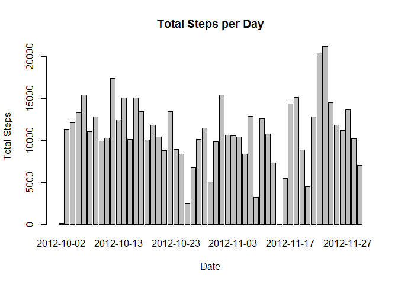
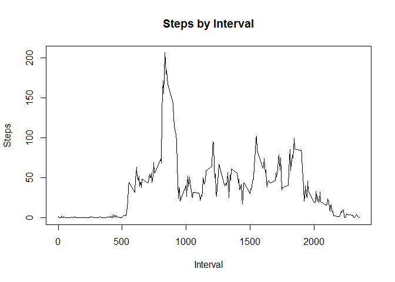
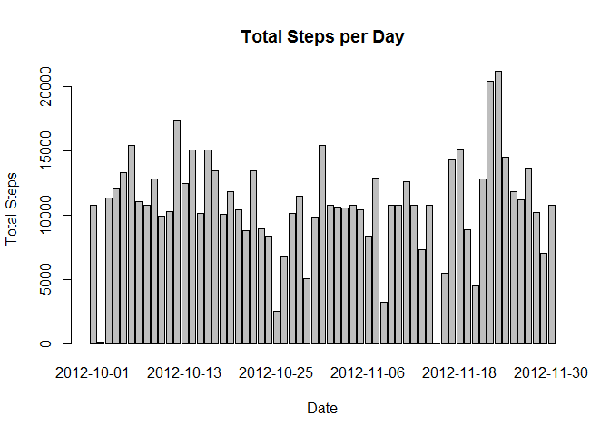

# Reproducible Research: Peer Assessment

## Loading and preprocessing the data

1. Loading the raw data


```r
activity <- read.csv("activity.csv")
```

2. Modify the dataset so there are no missing values present:  


```r
activity_nomiss <- activity[complete.cases(activity),]
```

## What is mean total number of steps taken per day

1. First we will summarize the activity_nomiss by date using the aggregate function and then we will create a barplot showing us the total number of steps by day


```r
stepsbyday <- aggregate(activity_nomiss$steps,by=list(activity_nomiss$date),sum)
names(stepsbyday) <- c("date","steps")
barplot(stepsbyday$steps, names.arg=stepsbyday$date, xlab="Date", ylab="Total Steps", main="Total Steps per Day")
```

 

2. To find the Mean:


```r
mean(stepsbyday[,2])
```

```
## [1] 10766
```

To find the Median:


```r
median(stepsbyday[,2])
```

```
## [1] 10765
```

## What is the average daily activity pattern?

1. First we need to find the average steps by interval


```r
stepsbyint <- aggregate(activity_nomiss$steps,by=list(activity_nomiss$interval),mean)
names(stepsbyint) <- c("interval", "steps")
```

Then we can use the plot command to create the time series:


```r
plot(stepsbyint$interval, stepsbyint$steps, type="l", xlab="Interval", ylab="Steps", main="Steps by Interval")
```

 

2. To determine which 5-minute interval had the maximum number of average steps, we do the following:


```r
stepsbyint[stepsbyint$steps==max(stepsbyint$steps), 1]
```

```
## [1] 835
```

## Imputing missing values

1. To calculate the total number of rows containing of missing values, we do the following:


```r
length(which(is.na(activity)))
```

```
## [1] 2304
```

2. To deal with the NA values we decided to replace them with the mean value for the corresponding interval as calculated a few steps above. It's also possible to calculate the mean steps per date and replace accordingly. It's not recommended to replace NA with zeros as this might have an unwanted impact to the mean and the median of the dataset.

3.

```r
activity_rep <- activity
for(i in 1:nrow(activity_rep)) {
    if(is.na(activity_rep[i,1])) {
      activity_rep[i,1] <- stepsbyint[stepsbyint$interval==activity_rep[i,3],2]
    }
}
```

4. Now we will make a new histogram with the replaced values in place


```r
stepsbyday_rep <- aggregate(activity_rep$steps,by=list(activity_rep$date),sum)
names(stepsbyday_rep) <- c("date","steps")
barplot(stepsbyday_rep$steps, names.arg=stepsbyday_rep$date, xlab="Date", ylab="Total Steps", main="Total Steps per Day")
```

 

Then we will calculate the mean and the median once again to see the effect of replacing the NA values.

To find the Mean:

```r
mean(stepsbyday_rep[,2])
```

```
## [1] 10766
```

To find the Median:

```r
median(stepsbyday_rep[,2])
```

```
## [1] 10766
```

As we can see the mean remains the same, but there is a slight change in the median.

## Are there differences in activity patterns between weekdays and weekends?

1. First we need to create a new variable which takes the value "Weekday" for days of the week and "Weekend" for days of the weekend. Then we need to split the dataframe into two, one with data from weekdays and one with data from weekends. All this is accomplished using the following code:


```r
weekday <- weekdays(as.Date(activity[,2]))
activity_week <- cbind(activity_rep, weekday)
weekend <- ifelse(activity_week$weekday %in% c("Saturday", "Sunday"),"Weekend", "Weekday")
activity_week <- cbind(activity_week, weekend)
activity_weekday <- activity_week[activity_week$weekend=="Weekday",]
activity_weekend <- activity_week[activity_week$weekend=="Weekend",]
```

2. The first step towards creating the required chart is to calculate the average of steps for the 5 minute intervals


```r
stepsbyint_weekday <- aggregate(activity_weekday$steps,by=list(activity_weekday$interval),mean)
stepsbyint_weekday[,3] <- "Weekday"
stepsbyint_weekend <- aggregate(activity_weekend$steps,by=list(activity_weekend$interval),mean)
stepsbyint_weekend[,3] <- "Weekend"
names(stepsbyint_weekday) <- c("interval", "steps_mean", "weekday")
names(stepsbyint_weekend) <- c("interval", "steps_mean", "weekday")
stepsbyint_combined = rbind(stepsbyint_weekday, stepsbyint_weekend)
```

Now we will create the plot using the lattice system


```r
library(lattice)
xyplot(stepsbyint_combined$steps ~ stepsbyint_combined$interval | stepsbyint_combined$weekday, layout = c(1, 2), type="a", xlab="Interval", ylab="Number of Steps")
```

 
